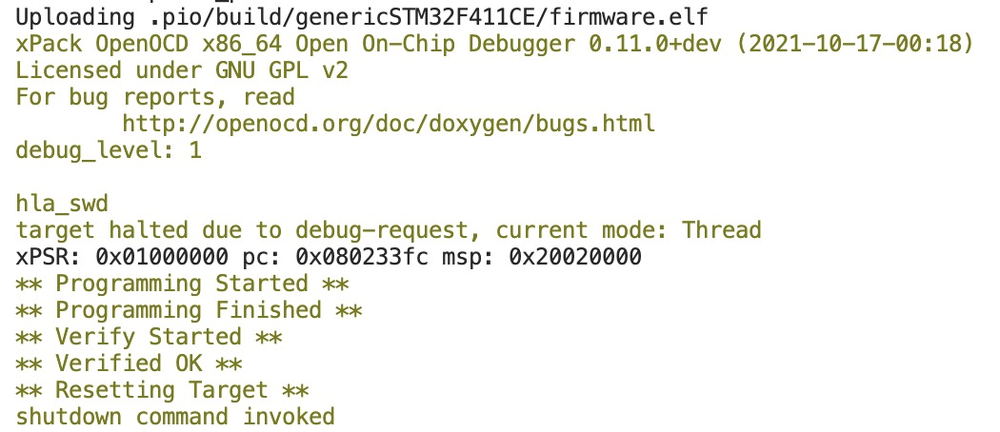

# Embedded-Watch
This project can run a watch program on your stm32 board. I am intend to making it as good as a lite version Apple iWatch.

## Overview

This repository contains only the source code of this project. That's being said codes from third-party are NOT provided. You can download the precompiled version by switching to the `binary` branch. That makes things much easier. The program was running on a `stm32f411ceu6` black pill board and also compatible with other F4 series microcontroller.

## Get it Started

Using the `binary` branch was recommended. 

**Step 1** Here are the required hardwares

- Round LCD Screen - 1.28''
- Any board `STM32F411CEU6` MCU on it.
- Some jumper wire.

**Step 2** Follow the diagram to connect devices.

| STM32 Pin IO | Device IO | Category |
| ------------ | --------- | -------- |
| PA5          | SCLK      | Screen   |
| PA7          | SDA       | Screen   |
| PC15         | DC (AO)   | Screen   |
| PB2          | RST       | Screen   |
| PC14         | CS        | Screen   |

**Step 3** Upload the binary file on the stm32 board.

Also you are welcomed to build with the source code. The binary file was located at this [page]().

## Dependencies

- `lvgl 8.2.0` - A light weight graphic library.
- `stm32 HAL` - STM32 official firmware support package.

