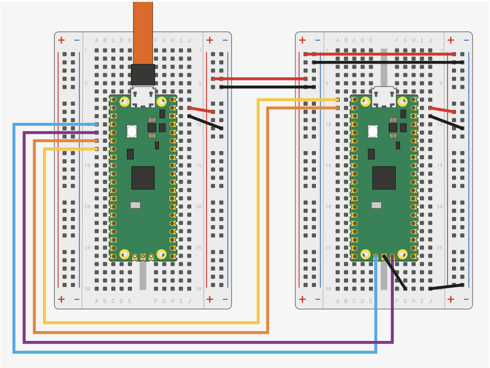

# Embedded-Watch Debug Mannual


## Pico Pi RP2040


### Hardware Wire Connect




*Wiring between Pico A (left) and Pico B (right) with Pico A acting as a debug probe. At least the ground and the two SWD wires must be connected, for one Pico to be able to reprogram and debug another. This diagram also shows how the UART serial port can be connected, so that you can see the UART serial output of the Pico-under-test, and how the power supply can be bridged across, so that both boards are powered by one USB cable*


While it has been designed with Raspberry Pi Pico, and other RP2040-based targets, in mind, the Raspberry Pi Debug Probe can be used to debug any Arm-based microcontroller that provides an SWD port with 3V3 I/O. Full documentation and more information about the Debug Probe can be found online on the documentation site.


### Build OpenOCD

- Install dependencies

  ```bash
  $ brew install libtool automake libusb wget pkg-config gcc texinfo
  ```

  


- Put texinfo on the path && Disable warning error

  ```bash
  $ cd ~/pico
  $ git clone https://github.com/raspberrypi/openocd.git --branch rp2040 --depth=1 $ cd openocd
  $ export PATH="/usr/local/opt/texinfo/bin:$PATH" 1
  $ ./bootstrap
  $ ./configure --disable-werror 2
  $ make -j4
  ```

  


- Download Pico debugger probe firmware

  ```bash
  $ cd ~/pico
  $ git clone https://github.com/raspberrypi/picoprobe.git
  $ cd picoprobe
  $ git submodule update --init
  $ mkdir build
  $ cd build
  $ cmake ..
  $ make -j4
  ```

  

  

### PlatformIO Setup

- Step 1

  Open visual studio code. Click on the PlatformIO home symbol, then on *Platforms* and *Advanced Installation*.

- Step 2

  In the next dialog, paste the URL **https://github.com/Wiz-IO/wizio-pico** and click on *Install*.

- Step 3

  Create a Pico project. Go the PlatformIO home screen, then click on *Projects* and *Create New Projects*. In the opening dialog, choose the board type *WizIO - Raspberry Pi Pico* and the framework *Baremetal* (this is the official C SDK).

  


## STM32 F411CEU6


